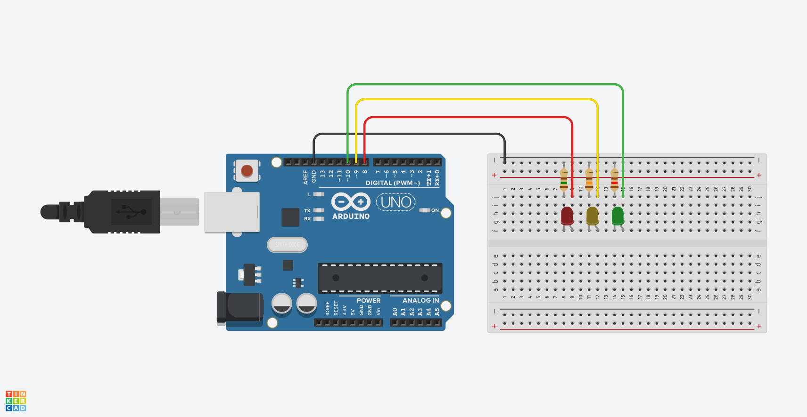

# Clase #1:

#### Bloque 1:
- Presentación de la asignatura. Puede descargar el programa [aquí](Aplicaciones_III_Perelli.pdf). 
- Revisión del calendario.
#### Bloque 2:
- Breve explicación de los diferentes usos y significados de los bits.
- Ejercicio en clases #1: Semáforo
  - ¿Cómo funciona un semáforo?
  - Objetivo: Encender secuencialmente 3 LEDs (rojo, amarillo y verde) tal y como un semáforo vial. Recuerde utilizar *pinMode*, y *digitalWrite*.
  - Recurso 1: puede simular su esquematico en [Tinkercad](http://www.tinkertcad.com/).
  - Recurso 2: calcular mediante ley de Ohm las resistencias para encender dichos LEDs para ello se utiliza [LED Calculator](https://ledcalculator.net/es).
  - Recuerde que las variables absolutas son aquellas que en su código se declaran fuera de los *void*.
  - Tarea #1: Terminar de sincronizar el semáforo vial agregando además un semáforo peatonal.
  - Tarea #2: Presentación personal (5 a 10 min) Se presenta en el bloque #2 de la clase del 8 de abril.
      - Considere Trayectoria y procedencia fuera del MAM
      - Trayectoria y trabajos relevantes para usted en el MAM
      - Intereses
      - Referentes.
