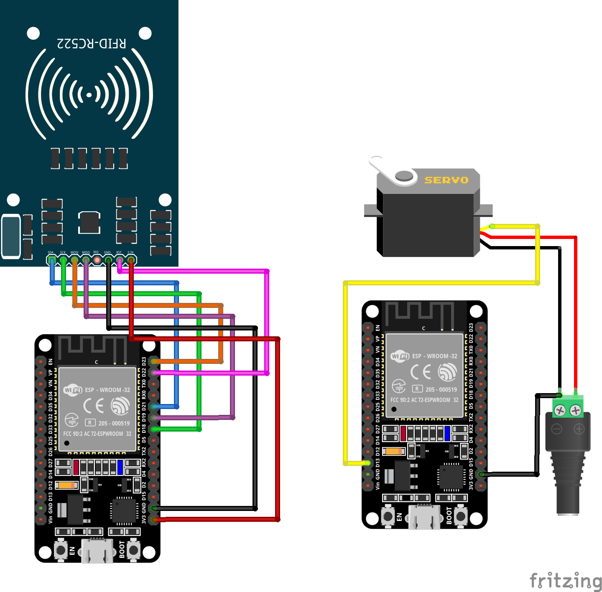

# Clase #11: Identificadores de Radiofrecuencia (RFID) e Internet de las cosas (IoT) 

## 🌐 ¿Qué es un WebSocket?

Un **WebSocket** es un protocolo de comunicación bidireccional que permite mantener una conexión abierta entre un cliente (por ejemplo, una ESP32) y un servidor (otra ESP32, PC o servidor web). A diferencia de HTTP, que requiere abrir y cerrar la conexión para cada mensaje, WebSockets permiten el **envío y recepción en tiempo real** con baja latencia.

Esto los hace ideales para aplicaciones como:

- Domótica
- Juegos online
- Comunicación entre dispositivos IoT

---

## 🌐 Comunicación en red entre ESP32/ESP8266

ESP32 y ESP8266 son microcontroladores con conectividad WiFi integrada. Permiten comunicación por protocolos como WebSockets, HTTP o MQTT.

### Diferencias clave con Arduino UNO y MKR1000:

| Placa       | WiFi | Bluetooth | Núcleos | Memoria | GPIO | Precio |
| ----------- | ---- | --------- | ------- | ------- | ---- | ------ |
| **ESP8266** | Sí   | No        | 1       | 4 MB    | ~11  | Bajo   |
| **ESP32**   | Sí   | Sí        | 2       | 4 MB    | >30  | Medio  |
| **UNO**     | No   | No        | 1       | 32 KB   | ~14  | Medio  |
| **MKR1000** | Sí   | No        | 1       | 256 KB  | ~22  | Alto   |

ESP32 y ESP8266 son ideales para proyectos IoT debido a su bajo costo y capacidades de red. MKR1000 ofrece conectividad WiFi con buena integración Arduino, pero a un precio mayor. Arduino UNO carece de conectividad inalámbrica nativa.

---

## ➕ ¿Cómo agregar placas ESP a Arduino IDE?

1. Abre el **Arduino IDE**
2. Ve a `Archivo > Preferencias`
3. En **Gestor de URLs adicionales de tarjetas**, agrega:
   - ESP32: `https://raw.githubusercontent.com/espressif/arduino-esp32/gh-pages/package_esp32_index.json`
   - ESP8266: `http://arduino.esp8266.com/stable/package_esp8266com_index.json`
4. Luego, ve a `Herramientas > Placa > Gestor de placas`
5. Instala **esp32** y/o **esp8266**
6. Selecciona tu placa desde el menú `Herramientas > Placa`

---

## 🛠️ Proyecto: RFID + ESP32 + Servomotor

### Descripción general

- **ESP32 #1 (RFID):** Lee tarjetas RFID (Mifare Classic) con un lector RC522 y envía el UID por WebSocket a la otra placa.
- **ESP32 #2 (Servo):** Recibe el UID y posiciona un servomotor en un ángulo específico para cada UID.

### Materiales

| Componente               | Cantidad | Características clave                                     |
| ------------------------ | -------- | --------------------------------------------------------- |
| ESP32 DevKit v1          | 2        | Doble núcleo, WiFi y BT integrados, 3.3V, GPIO abundantes |
| Lector RFID RC522        | 1        | Lectura 13.56 MHz, comunicación SPI                       |
| Tarjetas RFID/NFC        | 2+       | Mifare Classic o similar                                  |
| Servomotor SG90 o MG996R | 1        | Control por PWM, rotación hasta 180°                      |
| Jumpers + Protoboard     | varios   | Para conexiones                                           |
| Fuente 5V 2A (opcional)  | 1        | Para alimentar servos de alto torque                      |

### Librerías necesarias en Arduino IDE

#### ESP32 #1 (RFID)

- `MFRC522`
- `WiFi.h`
- `WebSocketsClient.h`

### Conexión RC522 ↔ ESP32

| RC522 (Lector RFID) | ESP32           | Descripción             |
|---------------------|------------------|--------------------------|
| SDA                 | GPIO 21          | Pin de selección (SS)   |
| SCK                 | GPIO 18          | Reloj SPI                |
| MOSI                | GPIO 23          | Datos hacia el módulo   |
| MISO                | GPIO 19          | Datos desde el módulo   |
| IRQ                 | No conectado     | (opcional)               |
| GND                 | GND              | Tierra                   |
| RST                 | GPIO 22          | Reset del lector         |
| 3.3V                | 3.3V             | Alimentación             |

> ⚠️ **Nota:** El RC522 debe conectarse a **3.3V**, no a 5V.

#### ESP32 #2 (Servo)

- `Servo.h`
- `WiFi.h`
- `WebSocketsServer.h`

### Conexión Servomotor ↔ ESP32

| Servomotor  | ESP32           | Descripción                   |
|-------------|------------------|-------------------------------|
| Señal       | GPIO 13          | PWM al servo                  |
| VCC         | Fuente 5V externa| Alimentación (NO desde ESP32)|
| GND         | GND compartido   | Tierra común con ESP32        |

> 🔋 **Importante:** Usar fuente externa (5V, 2A mínimo) si usas servos de alto torque como por ejemplo MG996R.
> Conecta la **GND de la fuente externa a la GND de la ESP32** para evitar bucles de tierra.

Todas las bibliotecas son instalables desde el **Library Manager** del Arduino IDE.
