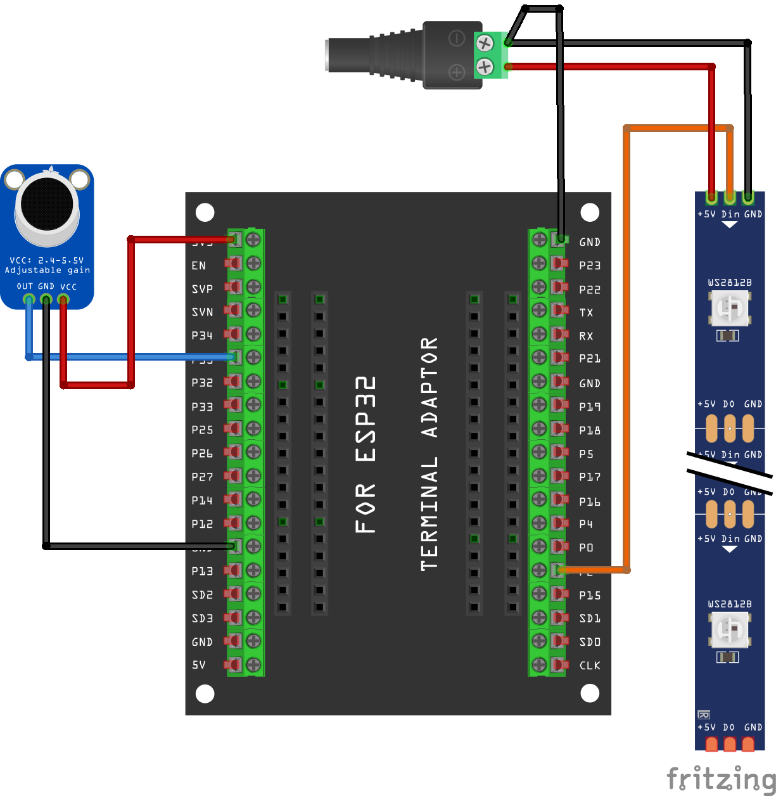

# 🚦 Clase 12: Tiras LED Direccionables + Audio Reactivo con WLED + ESP32

En esta clase aprenderemos a controlar una tira LED WS2812B mediante una **ESP32 WROOM** y hacerla **reaccionar al sonido** usando el **micrófono MAX4466** y el firmware **WLED 0.13.3**.

---

## 🎯 Objetivos

- Conectar una tira LED direccionable y un micrófono MAX4466.
- Configurar efectos audio-reactivos en WLED.
- Crear visuales LED que respondan al sonido.
- Trabajar con otras interfaces IoT flasheando el software en la ESP32 

---

## 🧰 Materiales necesarios

| Componente            | Cantidad |
|-----------------------|----------|
| ESP32 WROOM-32        | 1        |
| Tira LED WS2812B (5V) | 1        |
| Micrófono MAX4466     | 1        |
| Fuente de 5V (mínimo 2A) | 1     |
| Cables jumper         | varios   |
| Protoboard (opcional) | 1        |

---

## ⚙️ Esquema de Conexión

### 🔌 Tira LED (WS2812B)
| LED Pin | Conexión ESP32 / Fuente |
|---------|--------------------------|
| VIN     | 5V (fuente externa) |
| GND     | GND                      |
| DIN     | GPIO 2                   |

### 🎤 Micrófono MAX4466
| Mic Pin | Conexión ESP32 |
|---------|----------------|
| VCC     | 3V3            |
| GND     | GND            |
| OUT     | GPIO 35        |

> 🔧 **IMPORTANTE:** En WLED, debes **cambiar el pin de entrada de audio de 36 a 35**.

---

## 🔥 Instalación de WLED

### 1. Descargar WLED 0.13.3 para ESP32
- **IMPORTANTE** debes `usar Google Chrome`.
- Visita: https://install.wled.me
- Elige la versión **ESP32 (audio reactive)**

### 2. Flashear con ESPHome Flasher o ESP-Flasher
- Descarga: [ESP Flasher para Windows, Mac, Linux](https://github.com/esphome/esphome-flasher/releases)
- Conecta la ESP32 por USB.
- **Mantén presionado el botón BOOT** en la ESP32 durante todo el flasheo.
- Selecciona el puerto correcto y la imagen BIN descargada.

---

## 📶 Conectar a WLED

1. Una vez flasheada, busca una nueva red WiFi llamada `WLED-AP`.
2. Conéctate con la contraseña: `wled1234`.
3. Accede al navegador en: http://4.3.2.1
4. Configura tu red WiFi local (SSID y contraseña).
5. Guarda y reinicia.

---

## 🎧 Activar modo Audio Reactivo

1. Entra a la IP local de WLED (desde tu red WiFi).
2. Ve a **Config > Audio Reactive**.
3. Cambia el pin de entrada de audio a **GPIO 35**.
4. Guarda cambios y reinicia.

---

## 💡 ¡Listo! Prueba los efectos

- En la interfaz de WLED, navega a **FX** y selecciona efectos con icono de 🎵.
- Habla o haz sonar música cerca del micrófono.
- Ajusta la sensibilidad en el panel de audio si es necesario.

---

## 📁 Repositorio base

Este tutorial está basado en el proyecto de [WLED Sound Reactive](https://www.youtube.com/watch?v=_jZRzWsw8gs&t=509s)

---

## ✨ Ideas para ampliar

- Controlar múltiples zonas LED.
- Sincronizar efectos con música desde PC vía UDP o FFT.
- Combinar con sensores o visuales (VDMX, TouchDesigner, etc.).

---

## 🛠️ Problemas comunes

- **No responde el LED:** Verifica voltaje, conexión de datos (GPIO 2), dirección de la tira (flechas).
- **Micrófono no capta nada:** Ajusta el potenciómetro en el MAX4466 o revisa el pin configurado.
- **No se flashea WLED:** Verifica que el BOOT esté presionado al iniciar el flasheo.

