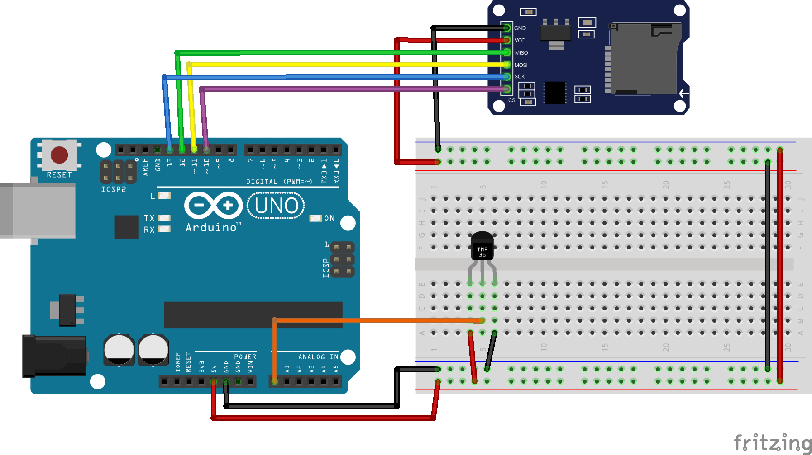

# Actividad en Clases: Captura de Información mediante Arduino y la Librería SD

En esta actividad trabajamos con el sensor de temperatura **TMP36** conectado a un microcontrolador **Arduino UNO**. El objetivo es capturar lecturas analógicas de temperatura, convertirlas a grados Celsius y Fahrenheit, y almacenar esta información en una tarjeta **microSD** usando la librería `SD.h`.

## Contenidos y pasos:

1. **Protocolos de comunicación**  
   Comenzamos distinguiendo entre los protocolos **I2C** e **SPI**. En esta actividad utilizamos el protocolo **SPI**, ya que es el requerido por la mayoría de los módulos microSD.

2. **Preparación de la tarjeta microSD**  
   Se utiliza una tarjeta microSD formateada en **FAT32**. En ella se crea automáticamente un archivo de texto plano llamado `data.txt` que almacenará las lecturas del sensor.

3. **Lectura del sensor TMP36**  
   El TMP36 está conectado al pin **A0** del Arduino. Se realiza una lectura analógica con `analogRead()`, que se convierte a voltaje y luego a temperatura:
   - El voltaje se calcula a partir del valor leído (escala de 0 a 5V).
   - La temperatura en °C se obtiene usando la fórmula: `(voltaje - 0.5) * 100`.
   - Luego se convierte a °F con: `(°C * 9 / 5) + 32`.

4. **Esquema de conexión del módulo microSD**  
   Según el estándar SPI, los pines del módulo microSD se conectan a Arduino de la siguiente manera:

   | Módulo microSD | Arduino UNO |
   |----------------|-------------|
   | **VCC**        | 5V          |
   | **GND**        | GND         |
   | **MOSI**       | Pin 11      |
   | **MISO**       | Pin 12      |
   | **SCK**        | Pin 13      |
   | **CS**         | Pin 10      |

   > En una comunicación SPI:  
   > - **VCC**: Alimentación 5V (generalmente)  
   > - **GND**: Tierra  
   > - **MOSI**: Master Output Slave Input  
   > - **MISO**: Master Input Slave Output  
   > - **SCK**: System Clock  
   > - **CS**: Chip Select  

   ### 🖼 Esquemático de conexión  
   

5. **Registro de datos en la microSD**  
   En cada ciclo de lectura:
   - Se imprime la información en el **Monitor Serial**.
   - Se abre el archivo `data.txt` en modo escritura (`FILE_WRITE`).
   - Se escriben el voltaje y las temperaturas en °C y °F.
   - Se cierra el archivo para asegurar el guardado correcto.

