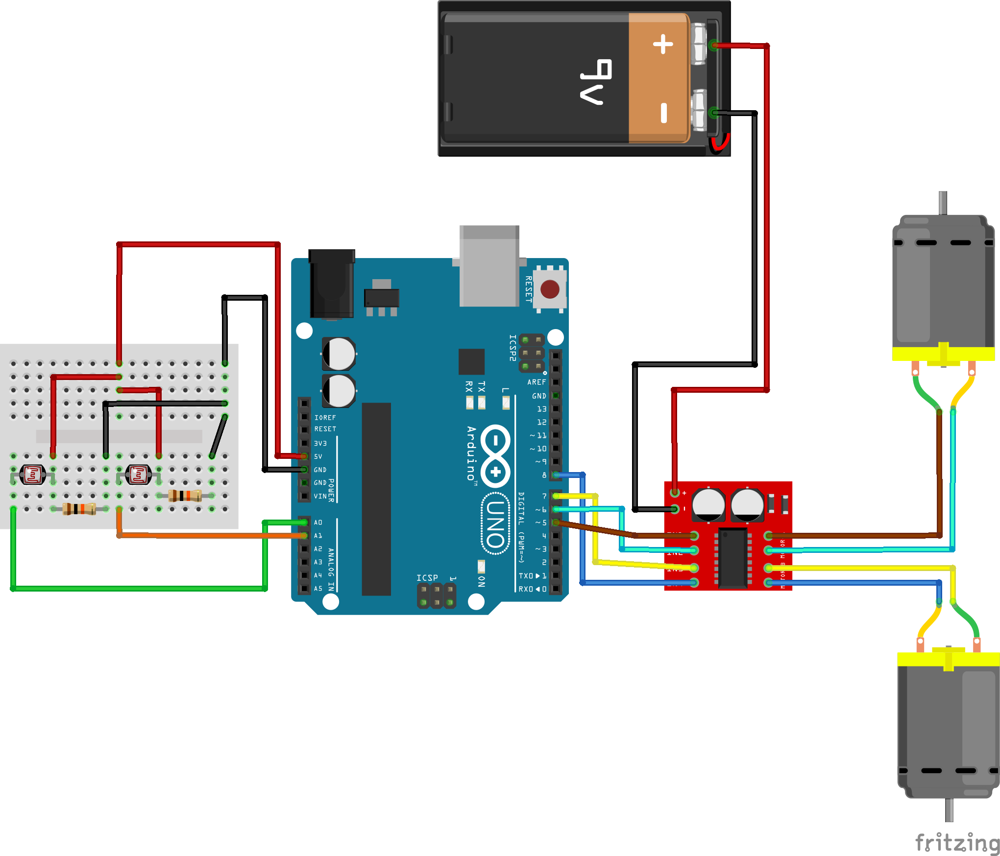

# Clase #6 Vehículos de Braitenberg

Basados en el libro **VEHICLES de Valentino Braitenberg (1984)** se Diseñan prototípos de vehículos basados en la conceptualización de un listado de Emociones.
Como base se dejan disponibles cinco prototípos de Vehículos para trabajar con ellos, modificarlos o proponer otras conceptualizaciones de emociones.

El objetivo de este trabajo es trabajar con Sensores (LDR, Ultrasonico o Distancia IR) como input o estímulo de las emociones. La respuesta del vehículo, según su configuración/emoción, determina el uso de H-Bridge para la gestion de motores DC.

## 🚧 Hardware general necesario

- 1 Arduino UNO/Nano/ESP32
- 2 motores DC
- 1 puente H MX1508 (o 2 canales de L298N)
- 1 chasis con ruedas
- Jumpers + fuente de alimentación (batería o power bank)

### 🚗 Vehículo 1 – "Miedo (Fear)" (Conexiones Inhibitorias)

**Comportamiento:** Se aleja de la luz. A más luz, menos velocidad en ese motor.

**Sensores:**  
- 2 LDR (fotoresistencias)

**Conexiones:**  
- LDR izquierda → motor izquierdo (inhibitorio)  
- LDR derecha → motor derecho (inhibitorio)

### 🚗 Vehículo 2 – "Agresión (Aggression)" (Conexiones Excitatorias)

**Comportamiento:** Se acerca a la luz. A más luz, más velocidad.

**Sensores:**
- 2 LDR

**Conexiones:**

- LDR izquierda → motor izquierdo (excitatorio)
- LDR derecha → motor derecho (excitatorio)

### 🚗 Vehículo 3 – "Amor (Love)" (Cruce Excitatorio)

**Comportamiento:** Gira hacia la luz y la sigue en forma curva.

**Sensores:**  
- 2 LDR

**Conexiones:**  
- LDR izquierda → motor derecho  
- LDR derecha → motor izquierdo (cruzado excitatorio)

### 🚗 Vehículo 4 – "Timidez Proactiva" (con Sensor Ultrasónico HC-SR04)

**Comportamiento:** Retrocede más rápido si detecta un objeto cerca.

**Sensor:**  
- 1 sensor ultrasónico HC-SR04

### 🚗 Vehicle 5 – "Curioso pero Precavido" (con Sharp 2y0a21)

**Comportamiento:** Se acerca lentamente a objetos lejanos, pero gira si están muy cerca.

**Sensor:**  
- 1 sensor infrarrojo Sharp GP2Y0A21
