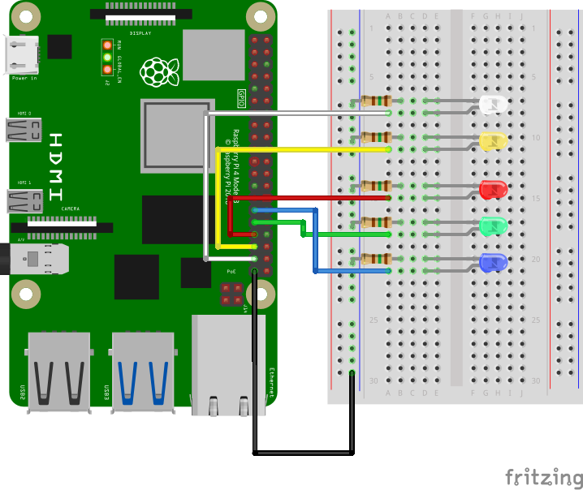

# Clase #7 Raspberry Pi: Introducción y Bots de Telegram

## Módulo 1: Introducción a Raspberry Pi

### Objetivo
Conocer las diferencias entre Raspberry Pi y Arduino, configurar el entorno de trabajo y comprender el uso de Python y PIP para el desarrollo de proyectos con hardware.

### Contenidos
- Diferencias clave entre Raspberry Pi y Arduino
- Configuración del sistema operativo (Raspberry Pi OS)
- Uso del terminal y Python en Raspberry Pi
- Instalación y uso de paquetes con `pip`

### Actividad
Configurar una Raspberry Pi y encender un LED mediante un script en Python que utilice `RPi.GPIO`.

### Diagrama de Pines GPIO


## Módulo 2: Bots de Telegram + GPIO + ffplay

### Objetivo
Crear un bot de Telegram que permita encender y apagar LEDs y reproducir videos en la Raspberry Pi desde comandos enviados a distancia.

### Contenidos
- Qué es un bot de Telegram y cómo se crea (BotFather)
- Librerías necesarias: `telepot`, `RPi.GPIO`, `os`
- Estructura básica de un bot con `telepot`
- Uso de `ffplay` (de ffmpeg) para reproducir videos en consola

### Requisitos previos
- Raspberry Pi conectada a internet
- Cuenta de Telegram y bot creado con BotFather
- Python 3 instalado
- Librerías: `pip install telepot RPi.GPIO`

### Actividad
**Construir y probar un sistema que permita:**
- Enviar comandos como `on red`, `off all` para controlar LEDs
- Ejecutar `video mi_video.mp4` para reproducir archivos desde `/home/pi/videos/`

### Esquemático de conexiones


### Comandos soportados:
```bash
on white
on all
off yellow
video demo.mp4
```

### Notas:
- Los LEDs deben estar conectados con resistencias de 220Ω
- Los videos deben estar ubicados en la carpeta `/home/pi/videos/`
- Asegúrate de que `ffmpeg` esté instalado:
```bash
sudo apt update
sudo apt install ffmpeg
```

---

## Links adicionales
- [Documentación de Raspberry Pi](https://www.raspberrypi.org/documentation/)
- [telepot GitHub](https://github.com/nickoala/telepot)
- [FFmpeg Documentation](https://ffmpeg.org/documentation.html)

## Apéndice: Entorno virtual y configuración del proyecto (Entornos Virtuales)

### ¿Por qué usar un entorno virtual en Python?
Los entornos virtuales permiten aislar las dependencias de un proyecto para evitar conflictos entre versiones de paquetes. Es una buena práctica para trabajar de forma ordenada y reproducible.

### Crear entorno virtual
```bash
sudo apt install python3-venv
python3 -m venv botenv
source botenv/bin/activate
```

### Instalar dependencias
```bash
pip install telepot RPi.GPIO
```

### Instalar Visual Studio Code
```bash
sudo apt update
sudo apt install code
```

### Cargar el archivo del bot
1. Abrir Visual Studio Code:
```bash
code
```
2. Instalar la extensión de Python desde el marketplace.
3. Abrir el archivo `bot_led_video.py` desde tu proyecto.
4. Ejecutar el script asegurándote de estar en el entorno virtual activo como interprete del proyecto.
